Benchmarks
==========

The following plots compare the performance of `moocore`_, `pymoo`_, `BoTorch`_, `DESDEO`_, `paretoset`_, `Nevergrad`_ and `jMetalPy`_. Other Python packages are not included in the comparison because they are based on these packages for the functionality benchmarked, so they are **at least as slow** as them. For example `Xopt`_ and `BoFire`_ use `BoTorch`_, `pysamoo`_ is an extension of `pymoo`_, `DESDEO`_ already uses `moocore`_ for hypervolume and other quality metrics, and most of the multi-objective functionality of `DEAP`_ is shared by `pymoo`_.  We do not compare with the Bayesian optimization toolbox `trieste`_, because it is much slower than `BoTorch`_ and too slow to run the benchmarks in a reasonable time.

Not all packages provide the same functionality. For example, `pymoo`_ does not provide the :ref:`epsilon indicator <epsilon_metric>` whereas `jMetalPy`_ does not provide the :ref:`IGD+ indicator <igd_hausdorf>`. `BoTorch`_ provides neither of them. `paretoset`_ only identifies nondominated points.

The source code for the benchmarks below can be found at https://github.com/multi-objective/moocore/tree/main/python/benchmarks .

Identifying nondominated points
-------------------------------

The following plots compare the speed of finding nondominated solutions, equivalent to :func:`moocore.is_nondominated`, in 2D and 3D. We test both ``keep_weakly=True`` and ``keep_weakly=False`` (the latter is not supported by `pymoo`_ nor `DESDEO`_).  The plots show that `moocore`_ is 10 times faster than `DESDEO`_ and `paretoset`_ and 100 times faster than the other packages.

|wndom_bench-test2D-200k| |wndom_bench-ran3d-40k|

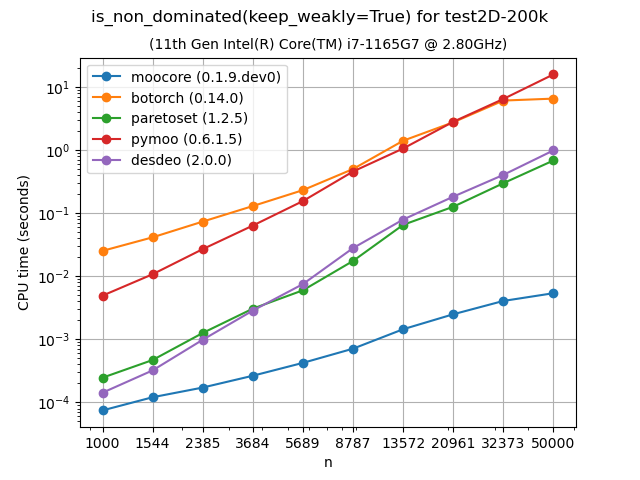

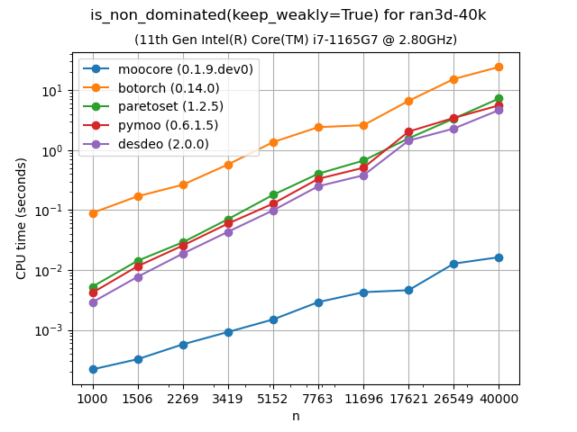

|ndom_bench-test2D-200k| |ndom_bench-ran3d-40k|

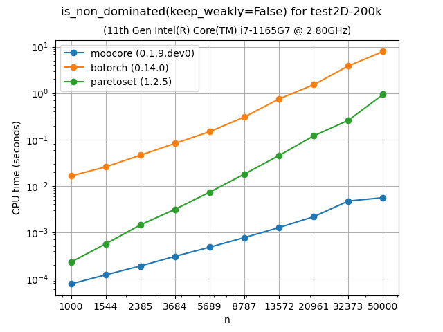

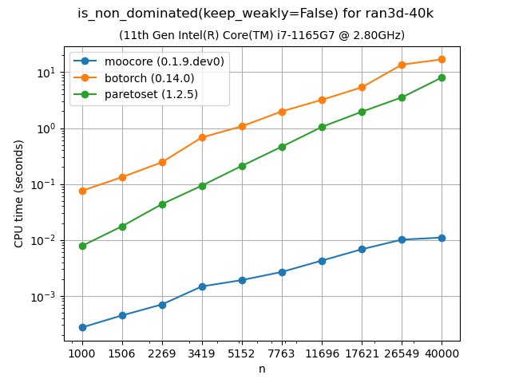

For dimensions larger than 3, :func:`moocore.is_nondominated` still uses the
naive :math:`O(m n^2)` algorithm.  Nevertheless, the plots show that `moocore`_ is still consistently faster than the other packages.

|wndom_bench-sphere-4d| |wndom_bench-sphere-5d|

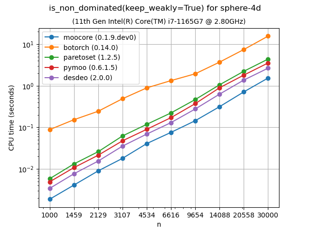

.. |wndom_bench-sphere-5d| image:: _static/bench/wndom_bench-sphere-5d-time.png
   :width: 49%

|ndom_bench-sphere-4d| |ndom_bench-sphere-5d|

.. |ndom_bench-sphere-4d| image:: _static/bench/ndom_bench-sphere-4d-time.png
   :width: 49%

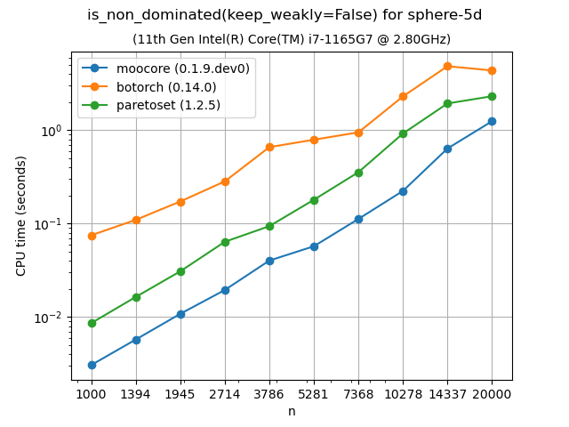

.. _bench-ndsort:

Nondominated Sorting (Pareto ranking)
-------------------------------------

Nondominated sorting (or Pareto ranking) assigns a rank to each point according
to Pareto-optimality. It can be used to split a set of points into layers of
nondominated fronts.  For more details, see :func:`moocore.pareto_rank`. This
function in `moocore`_ uses a :math:`O(n \log n)` algorithm for 2 dimensions
and a :math:`O(k\cdot n\log n)` algorithm for 3 dimensions.  As the plots show,
this makes `moocore`_ significantly faster than `paretoset`_, `pymoo`_ and
`DESDEO`_.  With higher dimensions, `moocore`_ uses the naive :math:`O(k m
n^2)` algorithm, similar to `paretoset`_ and `DESDEO`_ (if the latter are
compiled with `Numba`_). In these benchmarks points are sampled uniformly at
random within the hyper-cube.

|ndsort_bench-ran-2d| |ndsort_bench-ran-3d|

|ndsort_bench-ran-4d| |ndsort_bench-ran-5d|

.. |ndsort_bench-ran-2d| image:: _static/bench/ndsort_bench-ran-2d-time.png
   :width: 49%

.. |ndsort_bench-ran-3d| image:: _static/bench/ndsort_bench-ran-3d-time.png
   :width: 49%

.. |ndsort_bench-ran-4d| image:: _static/bench/ndsort_bench-ran-4d-time.png
   :width: 49%

.. |ndsort_bench-ran-5d| image:: _static/bench/ndsort_bench-ran-5d-time.png
   :width: 49%

Exact computation of hypervolume
--------------------------------

The following plots compare the speed of computing the :ref:`hypervolume indicator <hypervolume_metric>` in 3D, 4D, 5D and 6D. As the plots show, `moocore`_ is 100 times faster than the other packages and 1000 times faster than `BoTorch`_ and, by extension, `Xopt`_ and `BoFire`_.  `BoTorch`_ is not included for more than 4 objectives because **it is tens of thousands of times slower** than `moocore`_. `Nevergrad`_ is not included for more than 5 objectives for the same reason.

|hv_bench-DTLZLinearShape-3d| |hv_bench-DTLZLinearShape-4d|

|hv_bench-DTLZLinearShape-5d| |hv_bench-DTLZLinearShape-6d|

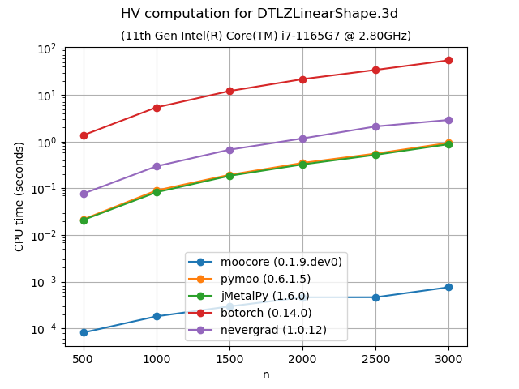

.. |hv_bench-DTLZLinearShape-4d| image:: _static/bench/hv_bench-DTLZLinearShape.4d-time.png
   :width: 49%

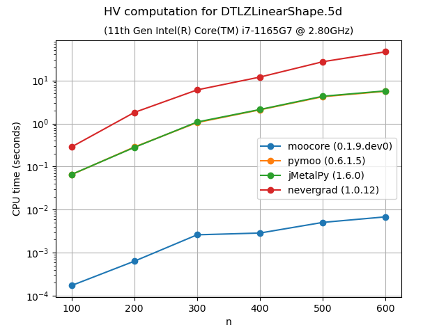

.. |hv_bench-DTLZLinearShape-6d| image:: _static/bench/hv_bench-DTLZLinearShape.6d-time.png
   :width: 49%

Approximation of the hypervolume
--------------------------------

The following plots compare the accuracy and speed of approximating the hypervolume with the various methods provided by :func:`moocore.hv_approx`. The plots show that method ``DZ2019-HW`` consistently produces the lowest approximation error, but it is also slower than method ``DZ2019-MC``.  When the number of points increases, both methods are significantly faster than `pymoo`_.

If you compare the plots of **DTLZLinearShape-3d** and **DTLZLinearShape-4d** below to the ones above in the previous section, you can see that the exact computation of the hypervolume in 3D or 4D for thousands of points takes milliseconds, whereas approximating the hypervolume is significantly slower and, thus, not worth doing.

|hvapprox_bench-DTLZLinearShape-3d-values| |hvapprox_bench-DTLZLinearShape-3d-time|

|hvapprox_bench-DTLZLinearShape-4d-values| |hvapprox_bench-DTLZLinearShape-4d-time|

Approximating the hypervolume becomes more useful for dimensions higher than 5, where the exact computation becomes noticeably slower with hundreds of points.  For such problems,  method ``DZ2019-HW`` is significantly slower for few points than  `pymoo`_, which is much slower than ``DZ2019-MC``. However, the computation time of ``DZ2019-HW`` increases very slowly with the number of points whereas the computation time of  `pymoo`_ increases very rapidly.

|hvapprox_bench-DTLZLinearShape-6d-values| |hvapprox_bench-DTLZLinearShape-6d-time|

|hvapprox_bench-DTLZSphereShape-6d-values| |hvapprox_bench-DTLZSphereShape-6d-time|

|hvapprox_bench-ran-6d-values| |hvapprox_bench-ran-6d-time|

|hvapprox_bench-DTLZLinearShape-9d-values| |hvapprox_bench-DTLZLinearShape-9d-time|

|hvapprox_bench-ran-9d-values| |hvapprox_bench-ran-9d-time|

|hvapprox_bench-DTLZSphereShape-10d-values| |hvapprox_bench-DTLZSphereShape-10d-time|

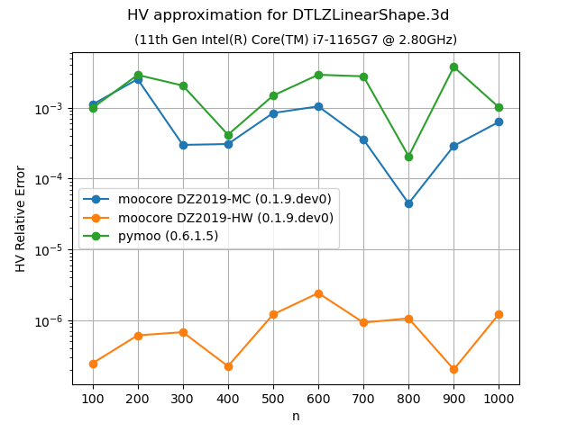

.. |hvapprox_bench-DTLZLinearShape-4d-values| image:: _static/bench/hvapprox_bench-DTLZLinearShape.4d-values.png
   :width: 49%

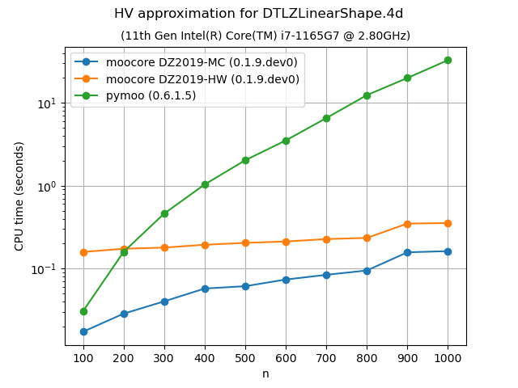

.. |hvapprox_bench-DTLZSphereShape-6d-values| image:: _static/bench/hvapprox_bench-DTLZSphereShape.6d-values.png
   :width: 49%

.. |hvapprox_bench-DTLZSphereShape-6d-time| image:: _static/bench/hvapprox_bench-DTLZSphereShape.6d-time.png
   :width: 49%

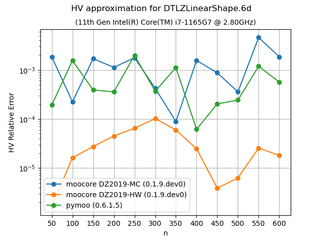

.. |hvapprox_bench-DTLZLinearShape-6d-time| image:: _static/bench/hvapprox_bench-DTLZLinearShape.6d-time.png
   :width: 49%

.. |hvapprox_bench-ran-6d-values| image:: _static/bench/hvapprox_bench-ran.6d-values.png
   :width: 49%

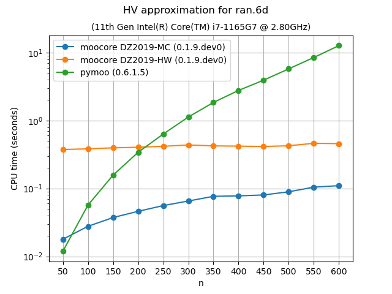

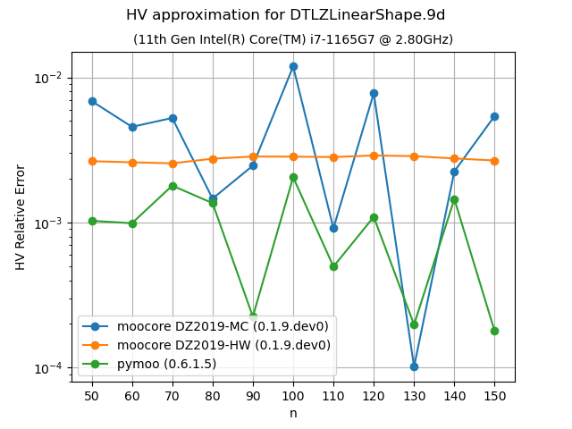

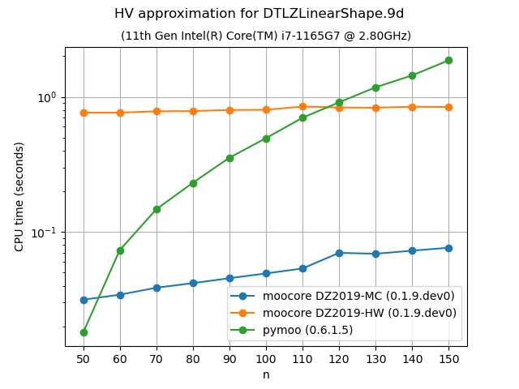

.. |hvapprox_bench-ran-9d-values| image:: _static/bench/hvapprox_bench-ran.9d-values.png
   :width: 49%

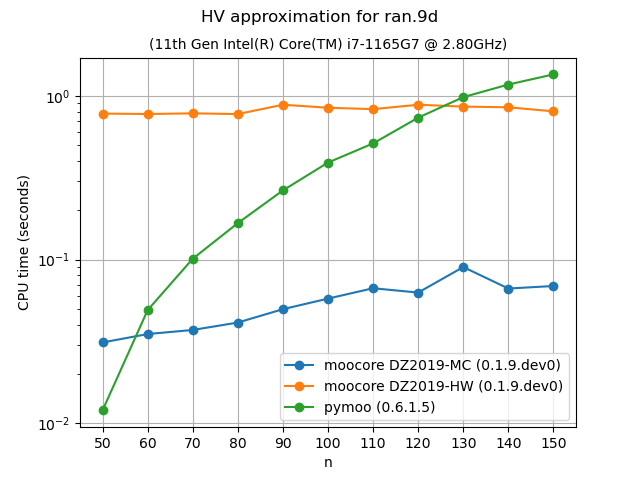

.. |hvapprox_bench-DTLZSphereShape-10d-values| image:: _static/bench/hvapprox_bench-DTLZSphereShape.10d-values.png
   :width: 49%

.. |hvapprox_bench-DTLZSphereShape-10d-time| image:: _static/bench/hvapprox_bench-DTLZSphereShape.10d-time.png
   :width: 49%

Epsilon and IGD+ indicators
---------------------------

The following plots compare the speed of computing the :ref:`epsilon indicator  <epsilon_metric>` metric and :ref:`IGD+ indicator <igd_hausdorf>`. Although  the algorithms for computing these metrics are relatively simple and easy to vectorize in Python, the `moocore`_ implementation is still 10 to 100 times faster.

|pic5| |pic6|

.. |pic5| image:: _static/bench/eps_bench-rmnk_10D_random_search-time.png
   :width: 48%

.. |pic6| image:: _static/bench/igd_plus_bench-ran.40000pts.3d-time.png
   :width: 48%

.. _moocore: https://multi-objective.github.io/moocore/python/
.. _pymoo: https://pymoo.org/
.. _BoTorch: https://botorch.org/
.. _jMetalPy: https://jmetal.github.io/jMetalPy/index.html
.. _DEAP: https://deap.readthedocs.io/en/master/
.. _Xopt: https://xopt.xopt.org/index.html
.. _BoFire: https://experimental-design.github.io/bofire/
.. _pysamoo: https://anyoptimization.com/projects/pysamoo/
.. _DESDEO: https://desdeo.readthedocs.io/en/latest/
.. _trieste: https://secondmind-labs.github.io/trieste
.. _Numba: https://numba.pydata.org/numba-doc/dev/index.html
.. _paretoset: https://github.com/tommyod/paretoset
.. _Nevergrad: https://facebookresearch.github.io/nevergrad/
