:orphan:

.. _benchmarks_archiving:

####################
Archiving Benchmarks
####################

The following plots compare the performance of archiving algorithms in `moocore`_ and `moarchiving`_.

The sequences are generated using :func:`~moocore.generate_ndset` and :func:`~moocore.generate_sequence`.

The source code for the benchmarks below can be found at https://github.com/multi-objective/moocore/tree/main/python/benchmarks .

Unbounded Archiving
-------------------

This benchmark compares :func:`~moocore.UnboundedArchive` and
:func:`~moarchiving.get_mo_archive`.  Each archive is given the number of
points in the x-axis, one at a time. We measure the CPU time required to
archive the whole sequence of points and divide it by the number of points,
which gives an estimation of the time to process each point for different input
sizes.  In addition, the plots show the total time required by
:func:`~moocore.filter_dominated` to process the input sequence. The time
required by :func:`~moocore.filter_dominated` can be seen as an upper-bound.

2D
~~

|unbarchive_add_bench-glas2017,c=0.5-2d-time| |unbarchive_add_bench-glas2017,c=2.0-2d-time|

|unbarchive_add_bench-hypercube-uniform-2d-time| |unbarchive_add_bench-hypercube-uniform-rep4-2d-time|

|unbarchive_add_bench-hypercube-ndsort=-1-2d-time| |unbarchive_add_bench-hypercube-ndsort=1-2d-time|

|unbarchive_add_bench-inverted-simplex-2d-time| |unbarchive_add_bench-within-concave-sphere-2d-time|

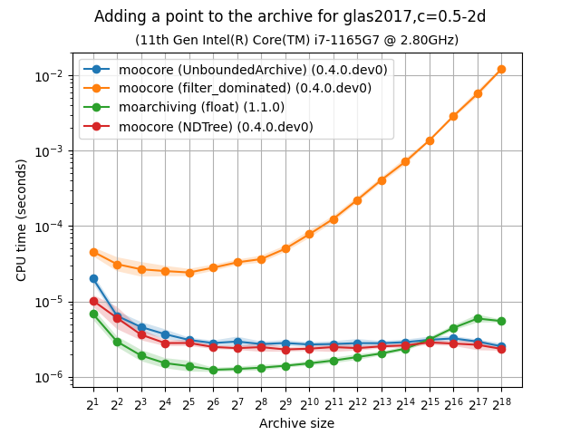

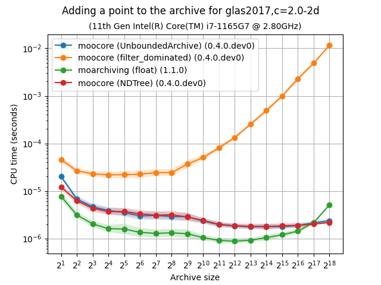

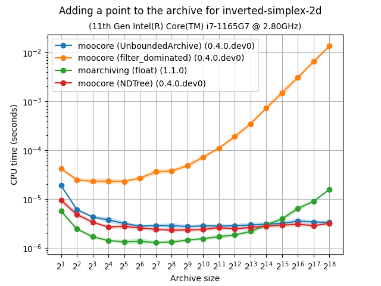

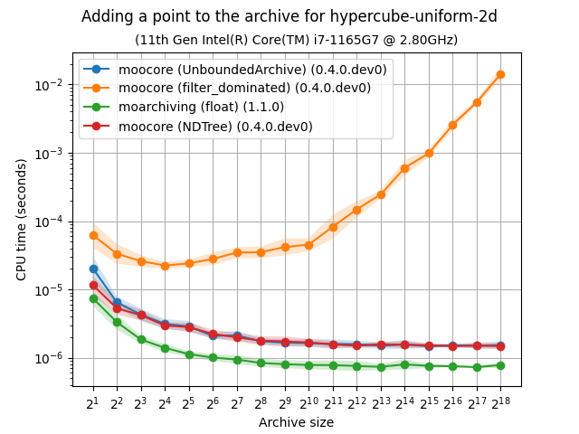

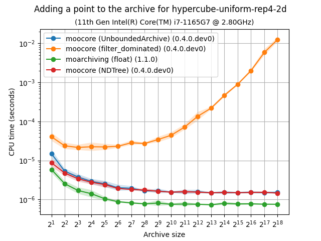

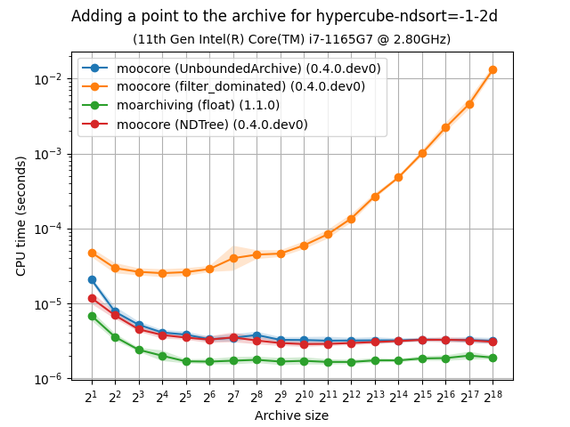

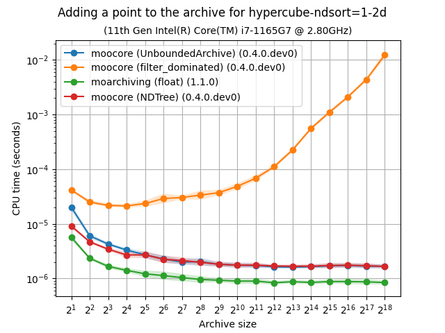

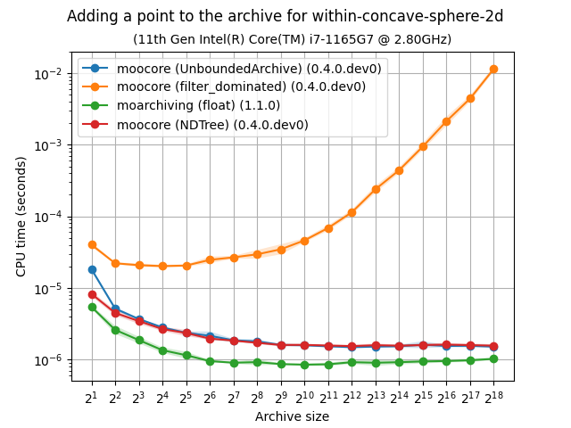

3D
~~

|unbarchive_add_bench-glas2017,c=0.5-3d-time| |unbarchive_add_bench-glas2017,c=2.0-3d-time|

|unbarchive_add_bench-hypercube-uniform-3d-time| |unbarchive_add_bench-hypercube-uniform-rep4-3d-time|

|unbarchive_add_bench-hypercube-ndsort=-1-3d-time| |unbarchive_add_bench-hypercube-ndsort=1-3d-time|

|unbarchive_add_bench-inverted-simplex-3d-time| |unbarchive_add_bench-within-concave-sphere-3d-time|

|unbarchive_add_bench-cliff-concave-3d-time| |unbarchive_add_bench-cliff-convex-3d-time|

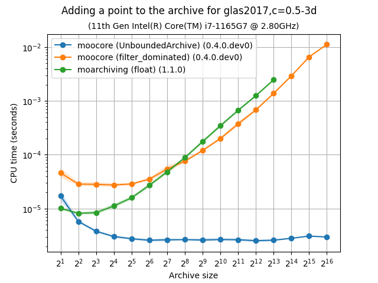

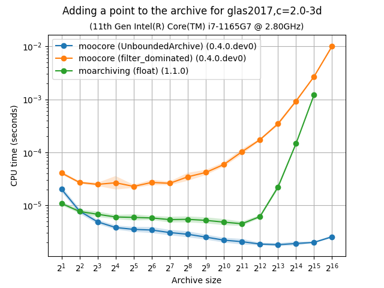

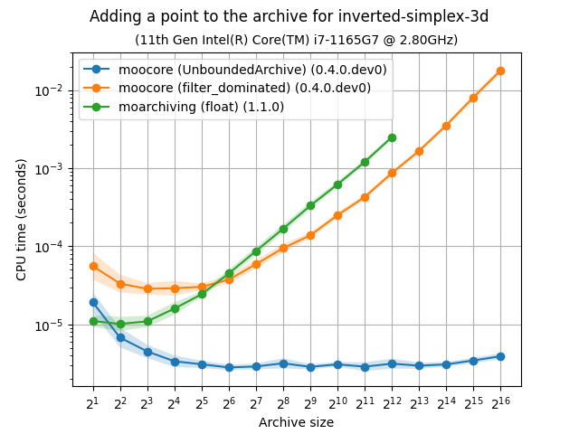

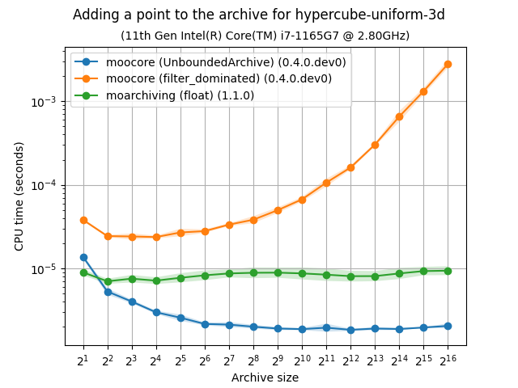

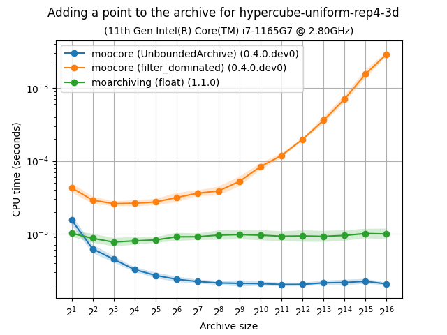

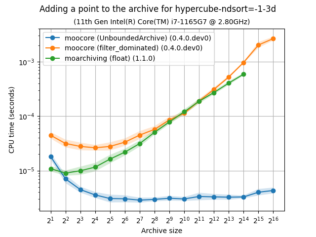

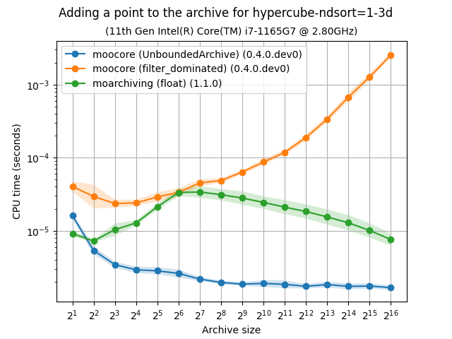

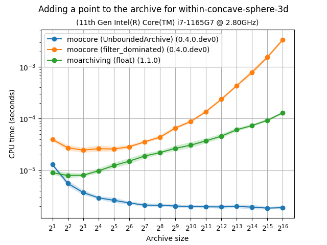

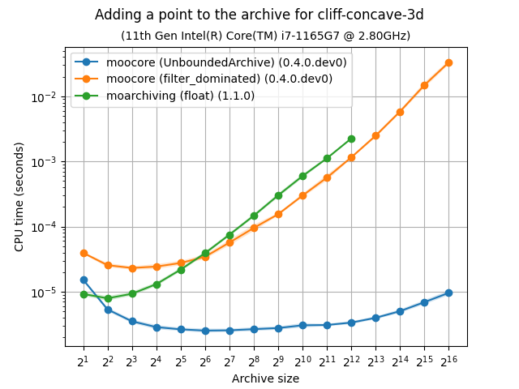

4D
~~

|unbarchive_add_bench-glas2017,c=0.5-4d-time| |unbarchive_add_bench-glas2017,c=2.0-4d-time|

|unbarchive_add_bench-hypercube-uniform-4d-time| |unbarchive_add_bench-hypercube-uniform-rep4-4d-time|

|unbarchive_add_bench-hypercube-ndsort=-1-4d-time| |unbarchive_add_bench-hypercube-ndsort=1-4d-time|

|unbarchive_add_bench-inverted-simplex-4d-time| |unbarchive_add_bench-within-concave-sphere-4d-time|

|unbarchive_add_bench-cliff-concave-4d-time| |unbarchive_add_bench-cliff-convex-4d-time|

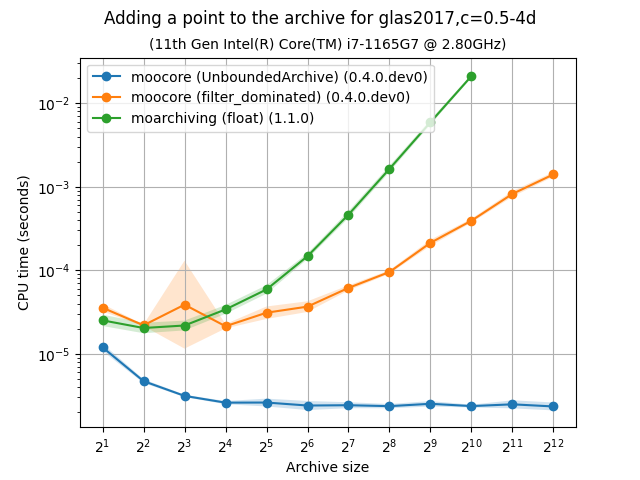

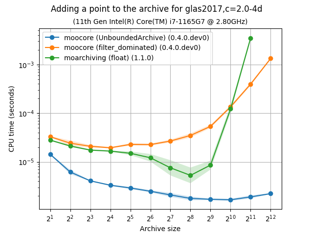

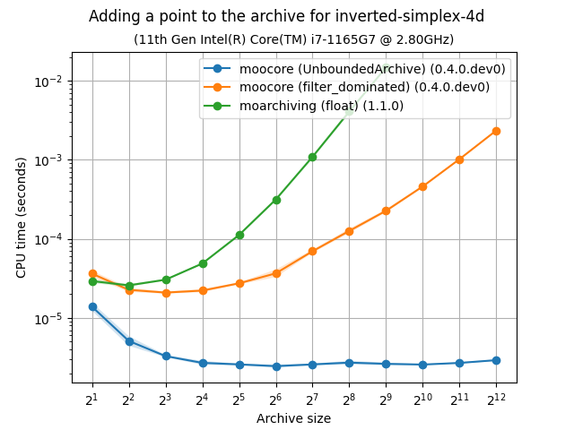

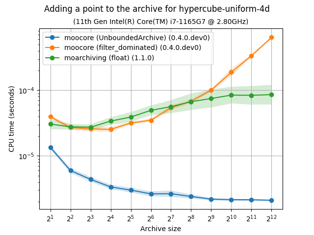

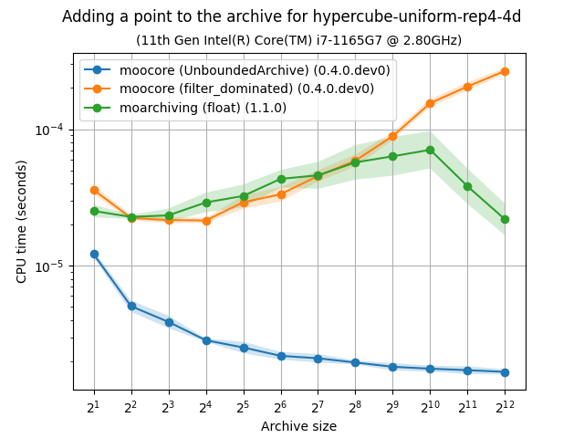

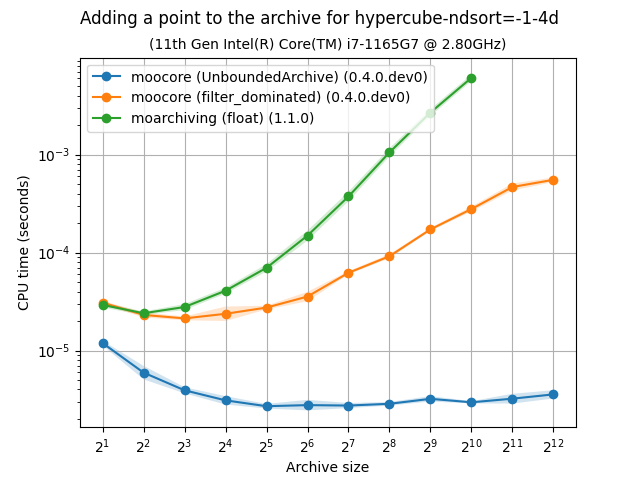

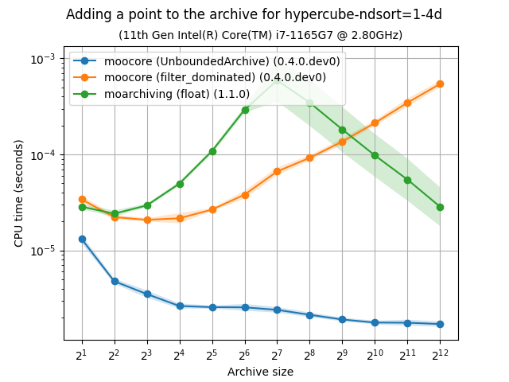

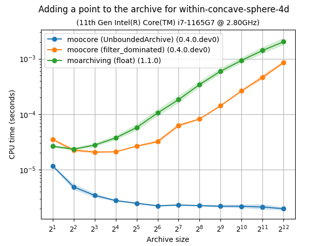

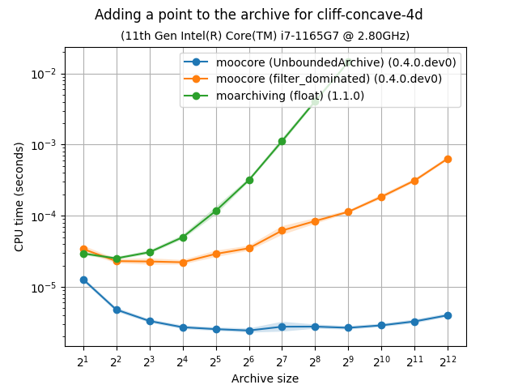

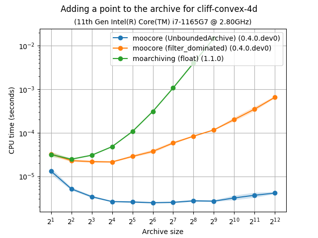

.. _moarchiving: https://cma-es.github.io/moarchiving/
.. _moocore: https://multi-objective.github.io/moocore/python/
