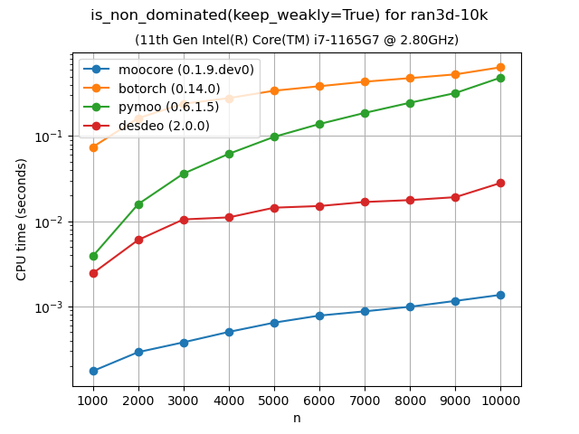
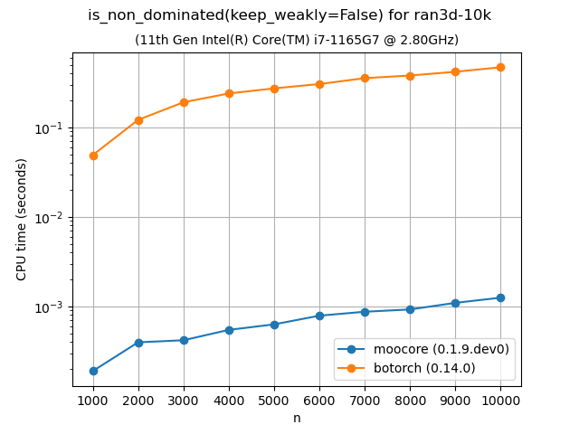

.. _moocore_docs_mainpage:

#########################################################
moocore: Core Algorithms for Multi-Objective Optimization
#########################################################

.. toctree::
   :maxdepth: 1
   :hidden:

   API reference <reference/index>
   Examples <auto_examples/index>
   whatsnew/index
   contribute/index

**Version**: |version| (:ref:`whatsnew`)

**Date** |today|

**Useful links**:
`Install <https://github.com/multi-objective/moocore/tree/main/python#install>`_ |
`Source Repository <https://github.com/multi-objective/moocore>`_ |
`Issue Tracker <https://github.com/multi-objective/moocore/issues>`_

This webpage documents the ``moocore`` Python package. There is also a  `moocore R package <https://multi-objective.github.io/moocore/r>`_.

The goal of the **moocore** project (https://github.com/multi-objective/moocore/) is to collect fast implementations of core mathematical functions and algorithms for multi-objective optimization and make them available to different programming languages via similar interfaces. These functions include:

* :ref:`Generate and transform nondominated sets <read_generate_transform_sets>`.
* :ref:`Identifying and filtering dominated vectors <identifying_and_filtering_dominated_vectors>`.
* :ref:`Quality metrics <unary_quality_metrics>` such as (weighted) hypervolume, epsilon, IGD+, etc.
* :ref:`Computation of the Empirical Attainment Function <empirical_attainment_function>`. The empirical attainment function (EAF) describes the probabilistic distribution of the outcomes obtained by a stochastic algorithm in the objective space.

Most critical functionality is implemented in C, with the R and Python packages providing convenient interfaces to the C code.

**Keywords**: empirical attainment function, summary attainment surfaces, EAF
differences, multi-objective optimization, bi-objective optimization,
performance measures, performance assessment

.. grid:: 2
    :gutter: 4
    :padding: 2 2 0 0
    :class-container: sd-text-center

    .. grid-item-card:: API Reference
        :img-top: _static/index_user_guide.svg
        :class-card: intro-card
        :shadow: md
        :link: api_reference
        :link-type: ref

        The reference guide contains a detailed description of the functions,
        modules, and objects.

    .. grid-item-card:: Examples
        :img-top: _static/index_getting_started.svg
        :class-card: intro-card
        :shadow: md
        :link: auto_examples
        :link-type: ref

        Detailed examples and tutorials.

Benchmarks
==========

The following plots compare the performance of `moocore`_, `pymoo`_, `BoTorch`_, and `jMetalPy`_. Other optimization packages are not included in the comparison because they are based on these packages for the functionality already benchmarked, so they are **at least as slow** as them. For example `Xopt`_ uses `BoTorch`_, `pysamoo`_ is an extension of `pymoo`_, `DESDEO`_ already `moocore`_ for hypervolume and other quality metrics, and most of the multi-objective functionality of `DEAP`_ is shared by `pymoo`_.  We do not compare with the Bayesian optimization toolbox `trieste`_, because it is much slower than `BoTorch`_ and too slow to run the benchmarks in a reasonable time.

Not all packages provide the same functionality. For example, `pymoo`_ does not provide the :ref:`epsilon indicator <epsilon_metric>` whereas `jMetalPy`_ does not provide the :ref:`IGD+ indicator <igd_hausdorf>`. `BoTorch`_ provides neither of them.

The source code for the benchmarks below can be found at https://github.com/multi-objective/moocore/tree/main/python/benchmarks .

Exact computation of hypervolume
--------------------------------

The following plots compare the speed of computing the :ref:`hypervolume indicator <hypervolume_metric>` in 3D, 4D, 5D and 6D. As the plots show, `moocore`_ is 100 times faster than the other packages and 1000 times faster than `BoTorch`_ and, by extension, `Xopt`_.  `BoTorch`_ is not included for more than 4 objectives because it is tens of thousands of times slower than `moocore`_.

|hv_bench-DTLZLinearShape-3d| |hv_bench-DTLZLinearShape-4d|

|hv_bench-DTLZLinearShape-5d| |hv_bench-DTLZLinearShape-6d|

.. |hv_bench-DTLZLinearShape-3d| image:: _static/hv_bench-DTLZLinearShape.3d-time.png
   :width: 49%

.. |hv_bench-DTLZLinearShape-4d| image:: _static/hv_bench-DTLZLinearShape.4d-time.png
   :width: 49%

.. |hv_bench-DTLZLinearShape-5d| image:: _static/hv_bench-DTLZLinearShape.5d-time.png
   :width: 49%

.. |hv_bench-DTLZLinearShape-6d| image:: _static/hv_bench-DTLZLinearShape.6d-time.png
   :width: 49%

Approximation of the hypervolume
--------------------------------

The following plots compare the accuracy and speed of approximating the hypervolume with the various methods provided by :func:`moocore.hv_approx`. The plots show that method ``DZ2019-HW`` consistently produces the lowest approximation error, but it is also slower than method ``DZ2019-MC``. When the number of points increases, both methods are significantly faster than `pymoo`_.

|hvapprox_bench-DTLZLinearShape-6d-values| |hvapprox_bench-DTLZLinearShape-6d-time|

|hvapprox_bench-DTLZSphereShape-10d-values| |hvapprox_bench-DTLZSphereShape-10d-time|

.. |hvapprox_bench-DTLZLinearShape-6d-values| image:: _static/hvapprox_bench-DTLZLinearShape.6d-values.png
   :width: 49%

.. |hvapprox_bench-DTLZLinearShape-6d-time| image:: _static/hvapprox_bench-DTLZLinearShape.6d-time.png
   :width: 49%

.. |hvapprox_bench-DTLZSphereShape-10d-values| image:: _static/hvapprox_bench-DTLZSphereShape.10d-values.png
   :width: 49%

.. |hvapprox_bench-DTLZSphereShape-10d-time| image:: _static/hvapprox_bench-DTLZSphereShape.10d-time.png
   :width: 49%

Identifying nondominated points
-------------------------------

The following plots compare the speed of finding nondominated solutions, equivalent to :func:`moocore.is_nondominated`, in 2D and 3D. We test both ``keep_weakly=True`` and ``keep_weakly=False`` (the latter is not supported by `pymoo`_ nor `DESDEO`_). Interestingly, `DESDEO`_ is significantly faster than `pymoo`_, despite the former using a naive Python implementation jit-compiled by `Numba`_ and the latter using CPython.  Nevertheless, As the plots show, `moocore`_ is 10 times faster than `DESDEO`_ and 100 times faster than the other packages.

|wndom_bench-test2D-200k| |wndom_bench-ran3d-10k|

|ndom_bench-test2D-200k| |ndom_bench-ran3d-10k|

.. |ndom_bench-test2D-200k| image:: _static/ndom_bench-test2D-200k-time.png
   :width: 49%

Epsilon and IGD+ indicators
---------------------------

The following plots compare the speed of computing the :ref:`epsilon indicator  <epsilon_metric>` metric and :ref:`IGD+ indicator <igd_hausdorf>`. Despite the algorithms for computing these metrics are relatively simple and easy to vectorize in Python, the `moocore`_ implementation is still 10 to 100 times faster.

|pic5| |pic6|

.. |pic5| image:: _static/eps_bench-rmnk_10D_random_search-time.png
   :width: 48%

.. |pic6| image:: _static/igd_plus_bench-ran.40000pts.3d-time.png
   :width: 48%

.. _moocore: https://multi-objective.github.io/moocore/python/
.. _pymoo: https://pymoo.org/
.. _BoTorch: https://botorch.org/
.. _jMetalPy: https://jmetal.github.io/jMetalPy/index.html
.. _DEAP: https://deap.readthedocs.io/en/master/
.. _Xopt: https://xopt.xopt.org/index.html
.. _pysamoo: https://anyoptimization.com/projects/pysamoo/
.. _DESDEO: https://desdeo.readthedocs.io/en/latest/
.. _trieste: https://secondmind-labs.github.io/trieste
.. _Numba: https://numba.pydata.org/numba-doc/dev/index.html

.. This is not really the index page, that is found in
   _templates/indexcontent.html The toctree content here will be added to the
   top of the template header
