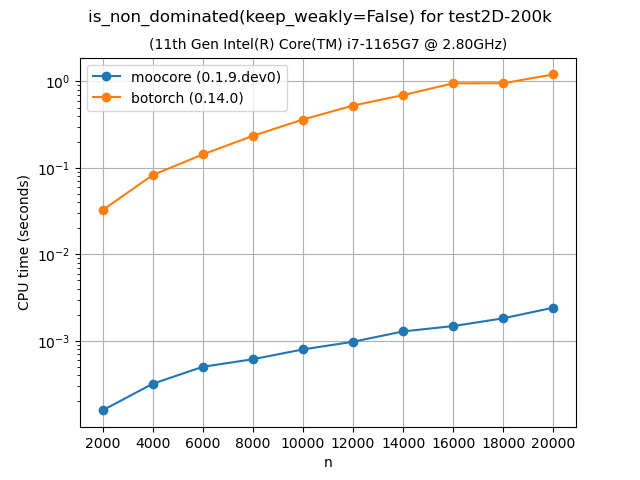

.. _moocore_docs_mainpage:

#########################################################
moocore: Core Algorithms for Multi-Objective Optimization
#########################################################

.. toctree::
   :maxdepth: 1
   :hidden:

   API reference <reference/index>
   Examples <auto_examples/index>
   whatsnew/index
   contribute/index

**Version**: |version| (:ref:`whatsnew`)

**Date** |today|

**Useful links**:
`Install <https://github.com/multi-objective/moocore/tree/main/python#install>`_ |
`Source Repository <https://github.com/multi-objective/moocore>`_ |
`Issue Tracker <https://github.com/multi-objective/moocore/issues>`_

This webpage documents the ``moocore`` Python package. There is also a  `moocore R package <https://multi-objective.github.io/moocore/r>`_.

The goal of the **moocore** project (https://github.com/multi-objective/moocore/) is to collect fast implementations of core mathematical functions and algorithms for multi-objective optimization and make them available to different programming languages via similar interfaces. These functions include:

* Identifying and filtering dominated vectors.
* Quality metrics such as (weighted) hypervolume, epsilon, IGD, etc.
* Computation of the Empirical Attainment Function. The empirical attainment function (EAF) describes the probabilistic distribution of the outcomes obtained by a stochastic algorithm in the objective space.

Most critical functionality is implemented in C, with the R and Python packages providing convenient interfaces to the C code.

**Keywords**: empirical attainment function, summary attainment surfaces, EAF
differences, multi-objective optimization, bi-objective optimization,
performance measures, performance assessment

.. grid:: 2
    :gutter: 4
    :padding: 2 2 0 0
    :class-container: sd-text-center

    .. grid-item-card:: API Reference
        :img-top: _static/index_user_guide.svg
        :class-card: intro-card
        :shadow: md
        :link: reference
        :link-type: ref

        The reference guide contains a detailed description of the functions,
        modules, and objects.

    .. grid-item-card:: Examples
        :img-top: _static/index_getting_started.svg
        :class-card: intro-card
        :shadow: md
        :link: auto_examples
        :link-type: ref

        Detailed examples and tutorials.

Benchmarks
----------

The following plots compare the speed of computing the :ref:`hypervolume indicator <hypervolume_metric>` in 3D and 4D using ``moocore``, `pymooo <https://pymoo.org/>`_, `BoTorch <https://botorch.org/>`_, `DEAP-er <https://deap-er.readthedocs.io/en/latest/>`_ and `jMetalPy <https://jmetal.github.io/jMetalPy/index.html>`_.

|pic1| |pic2|

The following plots compare the speed of finding nondominated solutions, equivalent to :func:`moocore.is_nondominated`, in 2D and 3D using ``moocore``, `pymooo <https://pymoo.org/>`_, and `BoTorch <https://botorch.org/>`_.

|pic3| |pic4|

.. |pic4| image:: _static/ndom_bench-ran3d-10k-time.png
   :width: 48%

The following plot compares the speed of computing the :ref:`epsilon <epsilon_metric>` and :ref:`IGD+ <igd_hausdorf>` metrics using ``moocore``, `pymooo <https://pymoo.org/>`_, and `jMetalPy <https://jmetal.github.io/jMetalPy/index.html>`_.

|pic5| |pic6|

.. |pic5| image:: _static/eps_bench-rmnk_10D_random_search-time.png
   :width: 48%

.. |pic6| image:: _static/igd_plus_bench-ran.40000pts.3d-time.png
   :width: 48%

.. This is not really the index page, that is found in
   _templates/indexcontent.html The toctree content here will be added to the
   top of the template header
