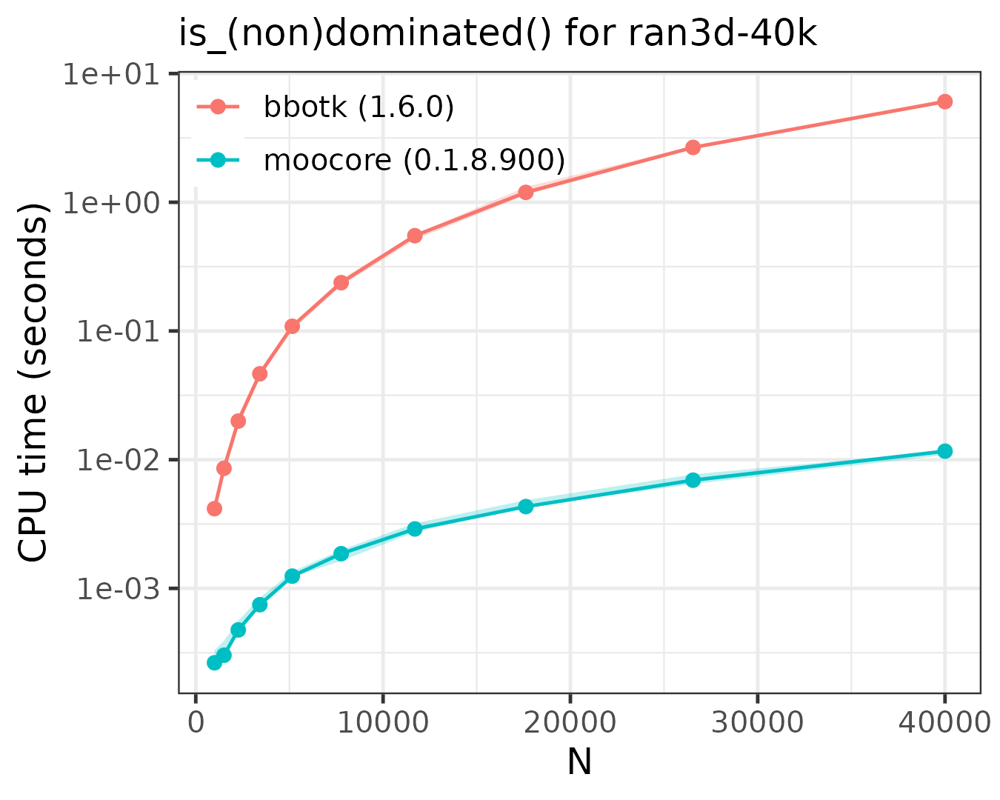
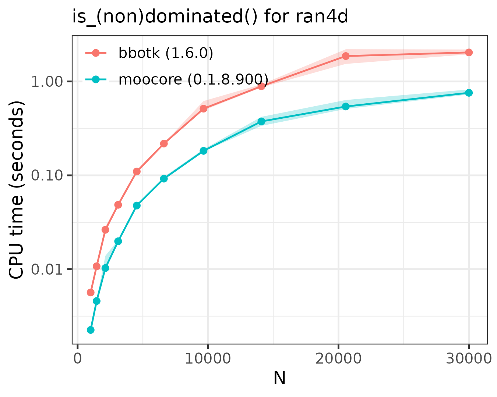
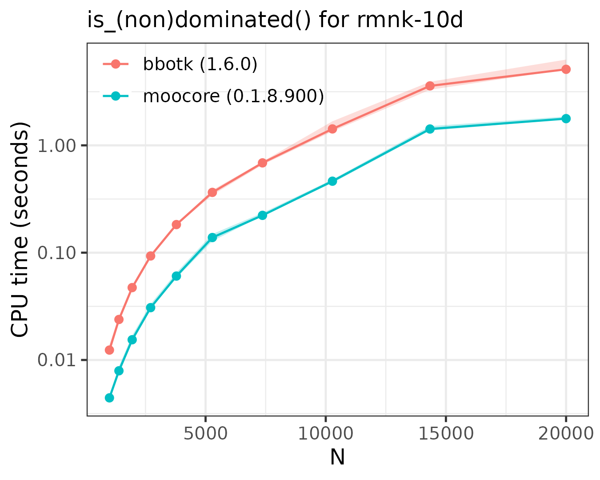
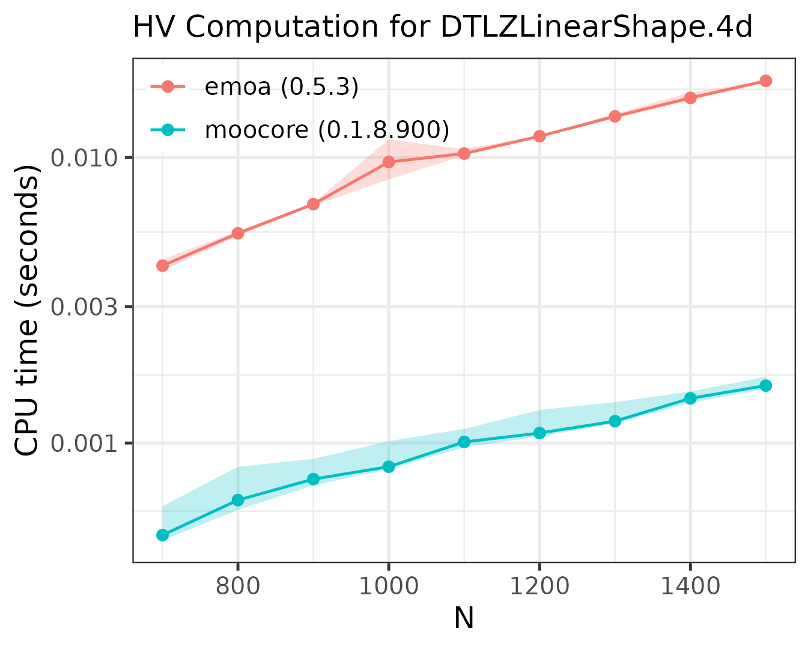

# Benchmarks

The following plots compare the performance of
[`moocore`](https://multi-objective.github.io/moocore/r/) against
[`emoa`](https://cran.r-project.org/package=emoa) and
[`bbotk`](https://cran.r-project.org/package=bbotk). Other R packages
are not included in the comparison because they are based on these
packages for the functionality benchmarked, so they are **at least as
slow** as them. For example
[`GPareto`](http://cran.r-project.org/package=GPareto),
[`mlr3mbo`](https://cran.r-project.org/package=mlr3mbo),
[`rmoo`](https://cran.r-project.org/package=rmoo) and
[`bbotk`](https://cran.r-project.org/package=bbotk) use
[`emoa`](https://cran.r-project.org/package=emoa) to compute the
hypervolume. Not all packages provide the same functionality.

Show benchmarking setup code

``` r
library(matrixStats)
library(data.table)
library(ggplot2)
library(moocore)

geomspace <- function(start, stop, num)
  round(exp(seq(log(start), log(stop), length.out = num)), 0)

get_dataset <- function(filename, filter=FALSE) {
  cat("Get file '", filename, "'\n")
  destfile <- system.file(file.path("extdata", filename), package="moocore")
  if (destfile == "") {
    destfile <- file.path("../../../testsuite/data", filename)
    if (!file.exists(destfile)) {
      fileext <- if (endsWith(destfile, ".xz")) ".xz" else ""
      destfile <- withr::local_tempfile(fileext = fileext)
      base_url <- "https://github.com/multi-objective/testsuite/raw/refs/heads/main/data/"
      utils::download.file(paste0(base_url, filename), destfile, quiet = FALSE)
    }
  }
  x <- read_datasets(destfile)
  x <- x[, -ncol(x)] # Union of datasets
  if (filter)
    x <- filter_dominated(x)
  x
}

# This is adapted from atime:::plot.atime
benchmark_plot <- function (x, title = "", only_seconds=TRUE, ...) {
  expr.name <- N <- kilobytes <- NULL
  meas <- x[["measurements"]]
  by.dt <- meas[, x$by.vec, with = FALSE]
  tall.list <- list()
  for (unit.i in seq_along(x$unit.col.vec)) {
    col.name <- x$unit.col.vec[[unit.i]]
    unit <- names(x$unit.col.vec)[[unit.i]]
    if (is.null(unit) || unit == "")
      unit <- col.name
    tall.list[[unit.i]] <- meas[, data.table(N, by.dt,
      unit, median = get(col.name))]
  }
  tall <- rbindlist(tall.list)
  if (only_seconds) {
    tall <- tall[unit=="seconds", ]
    ylab <- "CPU time (seconds)"
    legend.position <- c(0.25, 0.9)
  } else {
    ylab <- "median line, min/max band"
    legend.position <- c(0.8, 0.625)
  }
  gg <- ggplot() + theme_bw(base_size=12) +
    geom_ribbon(aes(N, ymin = min, ymax = max, fill = expr.name),
      data = data.table(meas, unit = "seconds"), alpha = 0.25, show.legend=FALSE) +
    geom_line(aes(N, median, color = expr.name), data = tall) +
    geom_point(aes(N, median, color = expr.name), data = tall) +
    scale_y_log10(ylab) +
    labs(subtitle = title) +
    theme(legend.title = element_blank(), legend.position = legend.position,
      legend.background = element_rect(fill="transparent"))
  if (!only_seconds)
    gg <- gg + facet_grid(unit ~ ., scales = "free")
  gg
}

get_package_version <- function(package)
  paste0(package, " (", as.character(packageVersion(package)), ")")

benchmark <- function(name, x, N, setup, expr.list, prefix, title) {
  rds_file <- paste0("bench/bench-", prefix, "-", name, ".rds")
  if (run_benchmarks || !file.exists(rds_file)) {
    lapply(names(expr.list), library, character.only = TRUE)
    names(expr.list) <- sapply(names(expr.list), get_package_version, USE.NAMES=FALSE)
    res <- substitute(atime::atime(
      N = N,
      expr.list = expr.list,
      setup = SETUP,
      result=FALSE,
      times=5,
      seconds.limit=10), list(SETUP=setup))
    res <- eval(res)
    saveRDS(res, file = rds_file)
  } else {
    res <- readRDS(rds_file)
  }
  gg <- benchmark_plot(res, title = paste0(title, " for ", name))
  gg
}
```

## Identifying (non)dominated points

The following plots compare the speed of finding (non)dominated
solutions, equivalent to
[`moocore::is_nondominated()`](https://multi-objective.github.io/moocore/r/reference/nondominated.md),
in 2D, 3D, 4D and 10D. The plots show that
[`moocore`](https://multi-objective.github.io/moocore/r/) is always
faster than [`bbotk`](https://cran.r-project.org/package=bbotk).

``` r
setup <- quote({
  stopifnot(nrow(x) >= N)
  z <- x[1:N, ]
  tz <- t(z)
})

expr.list <- list(
  moocore = quote(moocore::is_nondominated(z)),
  bbotk = quote(bbotk::is_dominated(tz)))

files <- list(
  "test2D-200k"=list(dataset="test2D-200k.inp.xz", N=geomspace(1000, 50000, 10)),
  "ran3d-40k"=list(dataset="ran.40000pts.3d.1.xz", N=geomspace(1000, 40000, 10)),
  "ran4d"=list(dataset="ran.9000pts.4d.10.xz", N=geomspace(1000, 30000, 10)),
  "rmnk-10d"=list(dataset="rmnk_0.0_10_16_1_0_random_search_1.txt.xz", N=geomspace(1000, 20000, 10))
)

for (name in names(files)) {
  p <- benchmark(name = name, x = get_dataset(files[[name]]$dataset, filter=FALSE),
    N = files[[name]]$N, prefix="ndom", title = "is_(non)dominated()",
    setup = setup,  expr.list = expr.list)
  print(p)
}
```



## Exact computation of hypervolume

The following plots compare the speed of computing the hypervolume
indicator in 3D, 4D, 5D and 6D.

``` r
setup <- quote({
  ref <- colMaxs(x, useNames = FALSE) + 1
  stopifnot(nrow(x) >= N)
  z <- x[1:N, ]
  tz <- t(z)
})

expr.list <- list(
  moocore = quote(moocore::hypervolume(z, ref = ref)),
  emoa = quote(emoa::dominated_hypervolume(tz, ref = ref)))

files <- list(
  "DTLZLinearShape.3d"=list(
    dataset = "DTLZLinearShape.3d.front.1000pts.10",
    N = seq(1000, 6000, 1000)),
  "DTLZLinearShape.4d"=list(
    dataset = "DTLZLinearShape.4d.front.1000pts.10",
    N = seq(700, 1500, 100)),
  "DTLZLinearShape.5d"=list(
    dataset = "DTLZLinearShape.5d.front.500pts.10",
    N = seq(400, 1000, 100)),
  "DTLZLinearShape.6d"=list(
    dataset = "DTLZLinearShape.6d.front.700pts.10.xz",
    N = seq(200, 700, 100))
)
for (name in names(files)) {
  p <- benchmark(name = name, x = get_dataset(files[[name]]$dataset, filter=TRUE),
    N = files[[name]]$N, prefix="hv", title = "HV Computation",
    setup = setup,  expr.list = expr.list)
  print(p)
}
```



As the plots show,
[`moocore`](https://multi-objective.github.io/moocore/r/) is always
faster than [`emoa`](https://cran.r-project.org/package=emoa) and,
hence, faster than
[`GPareto`](http://cran.r-project.org/package=GPareto),
[`mlr3mbo`](https://cran.r-project.org/package=mlr3mbo),
[`rmoo`](https://cran.r-project.org/package=rmoo) and
[`bbotk`](https://cran.r-project.org/package=bbotk).

## Hypervolume contribution

The only R package, other than
[`moocore`](https://multi-objective.github.io/moocore/r/), able to
compute hypervolume contributions
[`moocore::hv_contributions()`](https://multi-objective.github.io/moocore/r/reference/hv_contributions.md)
is [`emoa`](https://cran.r-project.org/package=emoa). However,
[`emoa`](https://cran.r-project.org/package=emoa) is buggy and
calculates wrong values
([olafmersmann/emoa#1](https://github.com/olafmersmann/emoa/issues/1)).
